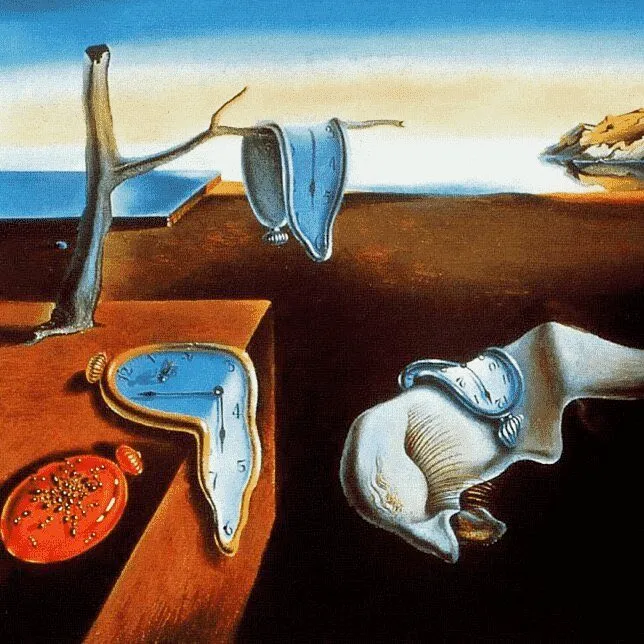
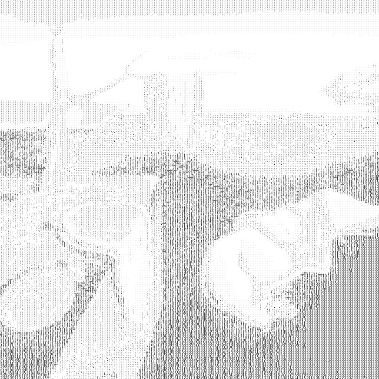

# ASCII Art Generator

A Python-based ASCII art generator that converts images and videos into beautiful ASCII art representations using individual character images. Enjoy transforming your media into text-based art!

## Quick Start

As an example, here is an input image and its corresponding ASCII art output:
<div align="center">
  
</div>

<div align="center">
  
</div>

Further exmaples of generated ASCII art can be found in the `output/` directory. This also includes a video output example (due to size there is only a short clip). **New to ASCII art generation?** Check out the [Jupyter Tutorial](ascii_art_tutorial.ipynb) for hands-on examples.

## How It Works

The generator works by:
1. **Character Generation**: Creates image representations of ASCII characters (space to ~) using monospace fonts
2. **Brightness Analysis**: Calculates average brightness for each ASCII character image
3. **Image Segmentation**: Divides input images into small sub-regions
4. **Character Matching**: Maps each sub-region to the ASCII character with the closest brightness
5. **Art Assembly**: Combines all ASCII character images to create the final ASCII art

## Usage

### As a Python Module

```python
import ascii_art_generator
from ascii_art_generator import generate_ascii_art, convert_video_to_ascii

# Generate ASCII art from an image
ascii_result = generate_ascii_art(
    image_path='path/to/your/image.jpg',
    num_sub_images_width=150,
    output_path='output/ascii_art.png'
)

# Convert a video to ASCII art
success = convert_video_to_ascii(
    input_video_path='path/to/your/video.mp4',
    output_video_path='output/ascii_video.mp4',
    num_sub_images_width=100,
    end_time=10.0  # Process first 10 seconds
)
```

### Interactive Tutorial

**For detailed examples and step-by-step guidance, check out our [Interactive Jupyter Tutorial](ascii_art_tutorial.ipynb)!**

### Setup

1. Clone this repository:
```bash
git clone https://github.com/yourusername/ascii_art_generator.git
cd ascii_art_generator
```

2. Install the module:
```bash
pip install -e .
```

3. The project comes with pre-generated ASCII character images. The tutorial will guide you through generating them if needed.

For video compression, ensure you have `ffmpeg` installed on your system. Otherwise video processing is done with openCV only.

## Tips for Best Results

1. **Image Selection**: High-contrast images work best
2. **Resolution**: Start with `num_sub_images_width=100-200` for testing
3. **Character Enhancement**: Increase `kernel_size` and `iterations` to finetune the matching of the characters.
4. **Performance**: Video processing can be slow; consider shorter clips rather than long videos.
5. **FFmpeg Installation**: For video compression and processing, ensure `ffmpeg` is installed on your system and accessible in your system's PATH.